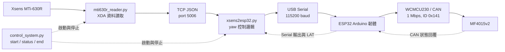

# SMR 程式運作框架

## 1. 目的與範圍

SMR 系統以 Xsens MTi-630R 量測姿態角度，並讓 MF4015v2 馬達依據 yaw 角度變化執行相對位置控制。系統將感測、上位機控制、序列傳輸及 CAN 馬達控制分層，避免 ESP32 同時承擔感測器驅動、網路處理與控制決策。

ESP32 的責任是將上位機傳入的控制命令轉為馬達 CAN frame；Xsens 資料讀取與 yaw 控制決策由 Python 執行。此文件說明目前程式實作的資料流、命令格式與啟停流程。

## 2. 元件與程式檔案

| 層級 | 硬體或程式 | 主要責任 |
| --- | --- | --- |
| 感測層 | Xsens MTi-630R | 量測加速度、角速度、磁場及姿態角；目前控制主要使用 yaw。 |
| 感測器程式 | `python/xsens/mti630r_reader.py` | 透過 Xsens 官方 XDA 函式庫讀取資料，輸出 TCP JSON 串流。 |
| 控制邏輯 | `python/xsens2esp32.py` | 將 yaw 變化轉為相對位置命令，經 USB Serial 傳至 ESP32。 |
| 系統管理 | `python/control_system.py` | 以 `start`、`status`、`end` 管理遠端 reader 與本機控制程式。 |
| 馬達韌體 | `esp32/mf5015v2_sample/mf5015v2_sample.ino` | 接收序列命令、產生 CAN frame、讀取馬達狀態。 |
| 通訊介面 | XIAO ESP32-S3 + WCMCU230 | ESP32 TWAI 控制器與 CAN 收發器，將 GPIO 邏輯訊號轉為 CANH/CANL 差動訊號。 |
| 致動器 | MF4015v2 | 接收 CAN 命令，內部驅動器執行速度或位置控制。 |

## 3. 整體資料流



資料流方向為 Xsens 到馬達；狀態與時間資訊則由馬達回到 ESP32，再回到 Python。`control_system.py` 不參與角度計算，只負責啟動、監看及結束整套程序。

## 4. Xsens 感測資料讀取

`mti630r_reader.py` 使用 Xsens 官方 `xsensdeviceapi` 開啟 MTi-630R，持續從 callback 取得感測器封包。程式可取得下列資料：

- 三軸加速度。
- 三軸角速度。
- 三軸磁場資料。
- roll、pitch、yaw 姿態角。

程式可將完整資料寫入 CSV，也可透過 TCP 或 UDP 輸出。提供給控制程式的 TCP 每一筆資料為以換行結尾的 JSON，主要欄位如下：

```json
{"time_s":1750000000.123,"imu_tx_ns":1750000000123456789,"roll":0.12,"pitch":-0.35,"yaw":45.67}
```

| 欄位 | 說明 |
| --- | --- |
| `time_s` | 人類閱讀用的 Unix 秒時間。 |
| `imu_tx_ns` | reader 準備送出 TCP JSON 時記錄的 Unix 奈秒時間。 |
| `roll`、`pitch`、`yaw` | 姿態角，單位為度。 |

預設資料讀取與串流頻率均為 100 Hz。控制用途只讀取 `yaw`，但保留 roll 與 pitch 使後續擴充多軸控制或資料檢查時不需變更協定。

## 5. `xsens2esp32.py`：yaw 到馬達命令

此程式是目前的控制核心。它預設連接 Xsens TCP `10.196.173.57:5006`，並以 `COM7`、115200 baud 與 ESP32 通訊。若未加上 `--arm`，程式只顯示計算出的命令，不會開啟 COM port 或控制馬達。

### 5.1 控制步驟

1. 接收 TCP JSON，確認 `yaw` 為有效數值。
2. 第一筆 yaw 建立基準角度，不移動馬達，並在 armed 模式送出 `s`。
3. 以 `wrap_degrees()` 將 yaw 差值限制為 `-180` 至 `+180` 度，避免跨越正負 180 度時產生 360 度誤判。
4. 當累積角度差大於等於 deadband，且距離上一次命令至少達 command period 時，建立相對位置命令。
5. 由角度差除以經過時間估算 yaw 速度，再乘上 gain，限制在最小與最大馬達速度範圍內。
6. 將命令寫入 ESP32 Serial，並將本次 yaw 作為新的控制基準。

預設控制參數如下：

| 參數 | 預設值 | 用途 |
| --- | ---: | --- |
| `--deadband` | `0.05` 度 | 抑制小於此值的角度變化，降低感測器雜訊造成的頻繁命令。 |
| `--command-period` | `0.01` 秒 | 最短命令間隔，對應最高約 100 Hz 的控制更新。 |
| `--gain` | `1.2` | 將估算的 yaw 速度放大，使馬達較能跟上感測器動作。 |
| `--min-speed` | `10 dps` | 馬達最小位置控制速度。 |
| `--max-speed` | `720 dps` | 馬達速度上限。 |
| `--speed-step` | `1 dps` | 對速度四捨五入，抑制速度命令抖動。 |

一般位置控制命令格式為：

```text
n <相對角度> <最大速度>
```

例如 `n -0.25 30` 表示馬達目標位置相對目前目標減少 0.25 度，最大速度為每秒 30 度。此命令是相對於軟體維護的目標位置，而不是每次直接指定機械零點。

### 5.2 資料中斷行為

`--watchdog` 預設為 0.5 秒。若超過此時間未收到 yaw，程式會在主控台提示資料逾時；目前程式保留最後一個位置目標，不會因 watchdog 自動送出停止命令。實驗時若需要資料中斷立即停止，應由操作流程送出 `s`，或在後續版本新增 fail-safe 停止策略。

### 5.3 延遲紀錄

每隔 `--latency-sample-every` 筆位置命令，預設每 10 筆，bridge 會送出含時間資訊的延伸命令：

```text
n <角度> <速度> <sequence> <imu_tx_ns> <bridge_tx_ns>
```

ESP32 成功確認 CAN frame 送出後，會回覆 `LAT`。bridge 將結果寫入 `logs/yaw_motor_latency.csv`。

| CSV 欄位 | 意義 |
| --- | --- |
| `imu_to_bridge_ms` | IMU reader 送出 JSON 到 bridge 收到的時間。 |
| `bridge_to_esp_ack_ms` | bridge 寫入 Serial 到收到 ESP32 `LAT` 回覆的時間。 |
| `imu_to_esp_ack_ms` | IMU 時間戳到收到 ESP32 回覆的端到端時間。 |
| `esp_serial_to_can_tx_ms` | ESP32 接收序列命令到確認 CAN 成功送出的時間。 |

`imu_to_bridge_ms` 與 `imu_to_esp_ack_ms` 依賴兩台電腦的系統時鐘同步。若時鐘不同步，需以 `--imu-clock-offset-ms` 修正，否則這兩個欄位只能作為趨勢參考。CSV 目前量到的是命令到 CAN 成功送出／確認回覆的通訊延遲，不等同於馬達機械軸實際開始轉動或到達目標的延遲；後者需再以編碼器回授與誤差門檻量測。

## 6. ESP32 Arduino 韌體與 CAN 通訊

韌體使用 ESP32 Arduino Core 內建的 `driver/twai.h`，不需額外安裝 ESP32CAN 函式庫。XIAO ESP32-S3 的腳位設定如下：

```text
D6 / GPIO43  -> WCMCU230 CTX / TXD
D7 / GPIO44  <- WCMCU230 CRX / RXD
3V3          -> WCMCU230 VCC
GND          -> WCMCU230 GND，並與馬達電源負極共地
```

CAN 設定為 1 Mbps、標準 CAN ID `0x141`。啟動時韌體先以輸入上拉檢查 TX/RX 腳位不是低電位，再設定 TX 為輸出、RX 為輸入上拉，並將 TX drive capability 設為最低等級，以降低 GPIO 輸出負擔。Arduino IDE 必須啟用 `USB CDC On Boot`，否則 D6/D7 無法依此設定使用。

### 6.1 Serial 命令

| 命令 | 功能 | 對應 CAN 命令 |
| --- | --- | --- |
| `r` | 讀取馬達狀態，輸出溫度、匯流排電壓與錯誤碼。 | `0x9A` |
| `m <dps>` | 連續速度控制；可使用負值反轉方向，範圍 -720 至 720 dps。 | `0xA2` |
| `n <deg> <dps>` | 相對位置控制；速度範圍 1 至 720 dps。 | 先讀 `0x92`，再送 `0xA4` |
| `s` | 停止馬達。速度模式時會漸減；位置模式或靜止時直接停止。 | `0x81` |

執行第一個 `n` 命令時，韌體先以 `0x92` 讀取馬達多圈角度，作為 `position_target_cdeg` 初始值。之後將每個相對角度換算為 0.01 度單位並累積成絕對目標位置，再以 `0xA4` 送至馬達。這個設計可避免上位機每次都需要知道馬達的絕對零點。

`n` 的延伸格式包含 sequence 和時間戳記。韌體會在收到 Serial 命令時記錄 `esp_rx_us`，確認 CAN 成功傳送時記錄 `esp_can_tx_us`，並輸出：

```text
LAT,<sequence>,<imu_tx_ns>,<bridge_tx_ns>,<esp_rx_us>,<esp_can_tx_us>
```

### 6.2 CAN 成功與失敗判斷

讀取、速度及停止命令使用 `can_exchange()`，韌體會先確認 `TX ACK: OK`，再等待對應 CAN 回覆。若出現 `TX failed: no CAN ACK` 或 `TWAI state=2`，表示 CAN 沒有可確認的節點或已進入 BUS_OFF；這是 CAN 實體層、終端電阻、鮑率、馬達供電或 CANH/CANL 接線問題，不應持續重送位置命令。

## 7. `control_system.py`：整體啟停管理

`control_system.py` 用於一般操作，不負責 yaw 控制計算。它透過 SSH 連接 Xsens 所在電腦，並以互動指令協助管理整套系統。

| 輸入 | 行為 |
| --- | --- |
| `start` | 先停止既有的遠端 reader，再透過遠端 Windows Process 建立 reader，確認 TCP 5006 監聽後啟動本機 `xsens2esp32.py`。 |
| `status` | 顯示本機 bridge 是否執行，以及遠端 TCP reader 是否監聽。 |
| `end` | 先要求 bridge 結束，嘗試送出最後的 ESP32 `s`，再停止遠端 reader。 |
| `quit` | 執行與 `end` 相同的結束流程後離開。 |

bridge 的輸出會在控制器視窗前加上 `BRIDGE>` 前綴，同時寫入 `logs/xsens2esp32.log`。SSH 密碼由執行時輸入或環境變數 `IMU_SSH_PASSWORD` 取得，不寫入 Python 原始碼。

## 8. 建議操作流程

### 8.1 啟動前檢查

1. 確認 Xsens 電腦與控制電腦可透過網路互通，且遠端 SSH 可連線。
2. 確認 ESP32、WCMCU230、馬達電源與 CANH/CANL 已依硬體接線表完成接線。
3. 確認 CANH 與 CANL 在斷電時的等效終端電阻約為 60 ohm。
4. 關閉 Arduino Serial Monitor、VS Code Serial Monitor 等會占用 `COM7` 的程式。
5. 先以 ESP32 的 `r` 指令確認能收到馬達狀態回覆，再啟用自動跟隨。

### 8.2 一般啟動

```powershell
cd C:\Users\e11512\Documents\Codex\smr\SMR-
python python\control_system.py --arm
```

輸入 SSH 密碼後，在互動提示字元輸入：

```text
start
```

若只想確認網路、Xsens 資料與程式決策，而不控制馬達，省略 `--arm` 即可進入 Dry Run。

### 8.3 停止

在 `control_system.py` 輸入：

```text
end
```

或以 `Ctrl+C` 結束。正常結束時，bridge 與控制器均會嘗試對 ESP32 發送 `s`。在任何異常情況下，仍應保留可立即切斷馬達外部電源的實體安全方式。

## 9. 後續改善方向

- 將 watchdog 改為資料中斷後主動發送停止命令，並在 CAN 無 ACK 時停止重試。
- 以馬達編碼器回授確認實際位置，建立感測器 yaw 與馬達位置的閉迴路誤差補償。
- 使用同一時間來源或 NTP/PTP 同步兩台電腦，以提高端到端延遲紀錄可信度。
- 新增控制參數設定檔，避免 IP、COM port、速度限制與 deadband 分散於命令列預設值。
- 將 CAN BUS_OFF、RX timeout 與馬達錯誤碼整理成可讀的故障狀態與自動保護策略。
